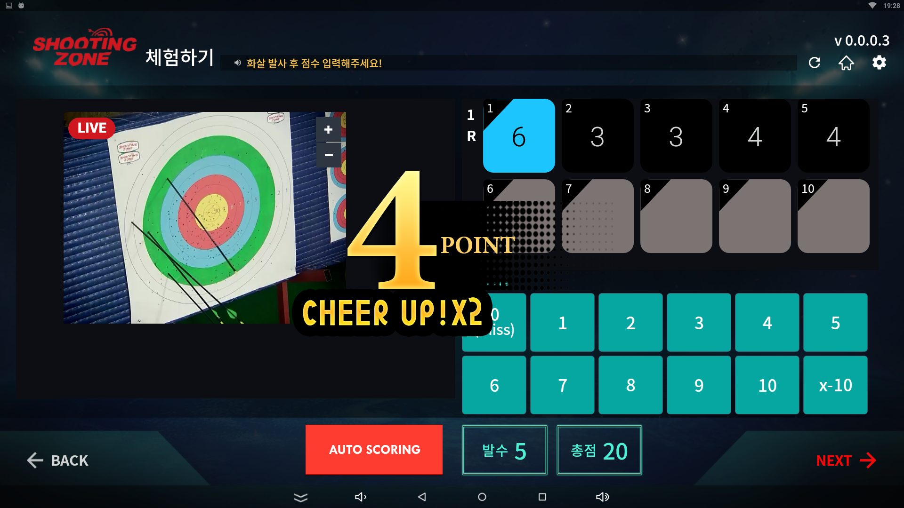

알텍에서 F사의 양궁 카페 프렌차이즈 점수 인식 프로그램을 개발한 Android Project  

과녁을 촬영중인 Cam을 live로 LAN으로 연결하여 점수인식 알고리즘을 통해 점수를 인식해 준다   

15발까지 발사 하여 점수를 매겨 사용자의 랭킹을 등록해 주는 기능이 추가 됬다 

OpenSource는 openCVLibrary330를 사용 했다. 

## Preview

