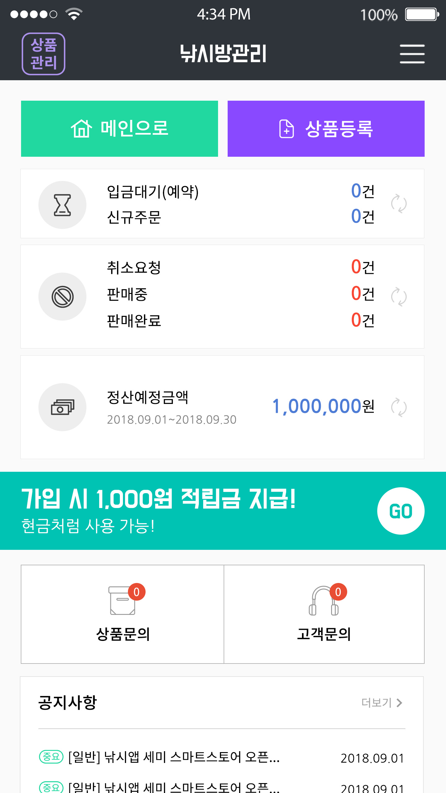

알텍에서 낚시 미끼를 사고파는 App을 만들기 위한 Android Project  

웹 서버는 AWS EC2, S3를 사용 
Ubuntu Server, MySQL, PHP를 설치 
phpmyadmin tool을 사용하여 ERD DB 제작

REST 아키텍처의 제약 조건으로 프로그래밍 인터페이스 설계했다. 

url 
<b>https://play.google.com/store/apps/details?id=artech.com.semi.free</b>

## Preview

