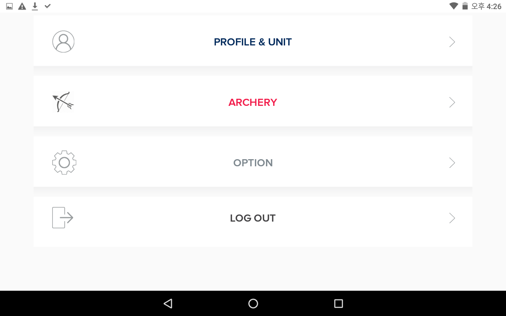
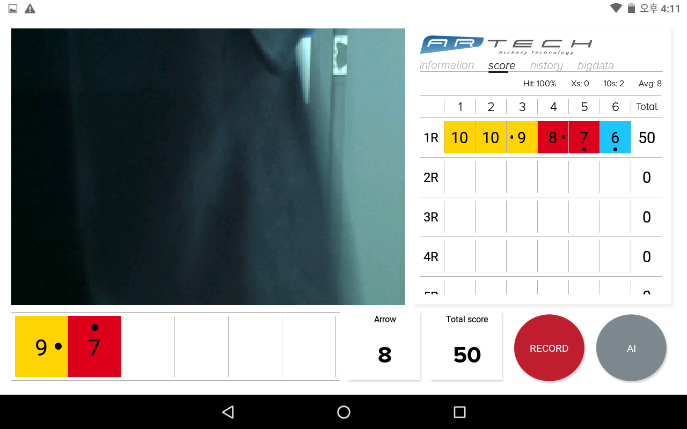
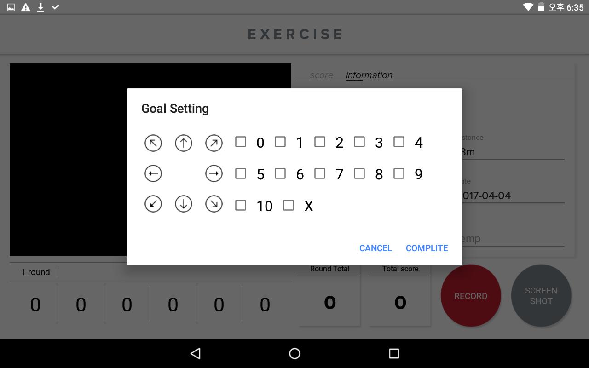

Standing-Egg에서 제작한 웨어러블 밴드와 연동된 Android App 
BLE 4.0 방식으로 밴드와 연동되며 StnEggPkt.java에서 패킷 데이터를 복호화 한다. 기본적으로 PKST 다음에 오는 packet data가 실 데이터. 
웨어러블 업데이트는 DFU 방식으로 업로드 시킨다. 

chart는 웹뷰로 불러오며 jquery의 highcharts lib 사용 

외부 DB는 사용 안하고 java SQLite 사용   

이 앱은 웨어러블의 working, running, fitnees(11종류), 양궁 모션 등이 들어간 앱이다.  
(주)알텍의 외뢰로 개발 됬으며 Raspberry Pi camera module을 streaming video service로 송신 받아 양궁 스코프, 점수 모니터링 영상을 출력한다. 

## Preview

