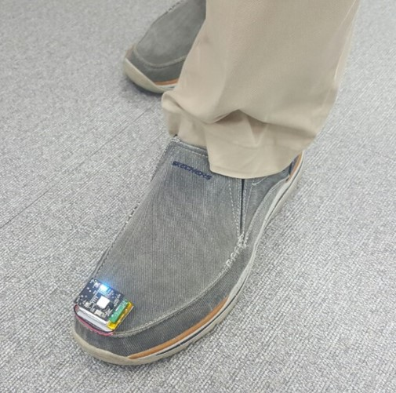
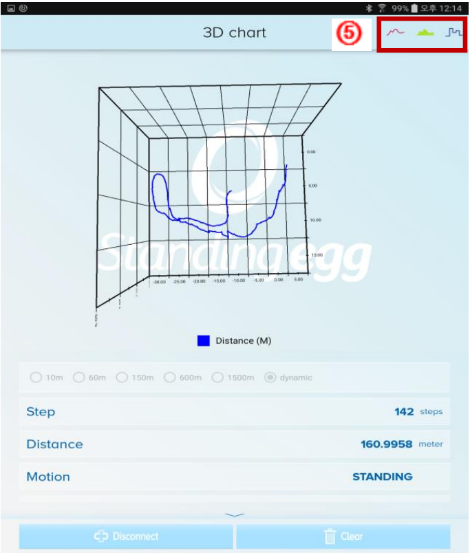
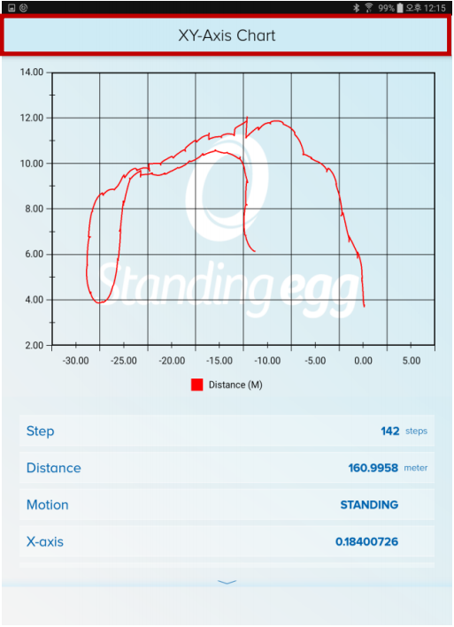
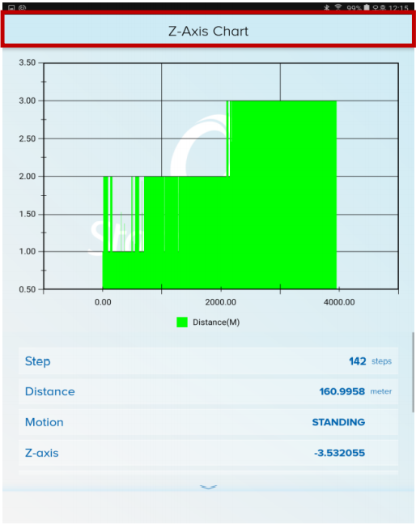
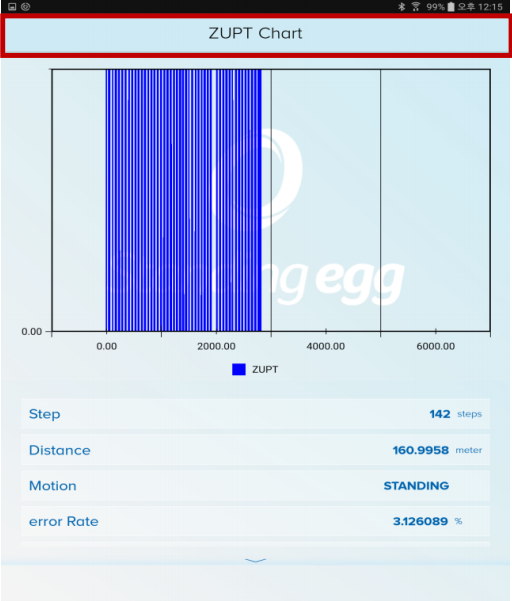

Standing-Egg에서 제작한 SGO100 EVK Black Board와 발걸음 Tracking 알고리즘을 암호화 code로 변환하여 BLE모듈과 wifi모듈을 통해 앱으로 전송 시키는 프로젝트 
Wifi는 udp 통신을 하며 BLE 4.0 통신을 한다. StnEggPkt.java에서 패킷 데이터를 복호화 한다. 기본적으로 PKST 다음에 오는 packet data가 실 데이터. 

chart는 NChart3D lib 실시간 렌더링 chart 사용 

이 앱은 Gait Tracking이라는 알고리즘을 효과적으로 보여주기 위해 만들었으며 3차원 공간에서의 움직임을 x,y,z 축으로 보여준다. 

## Preview

