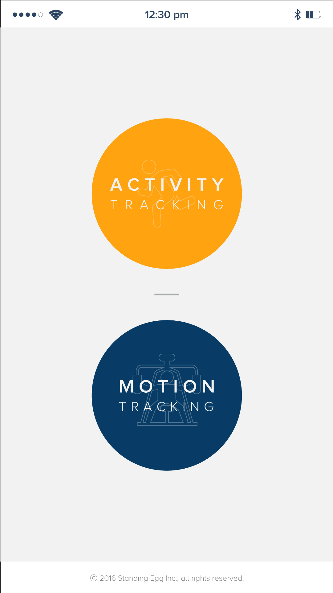
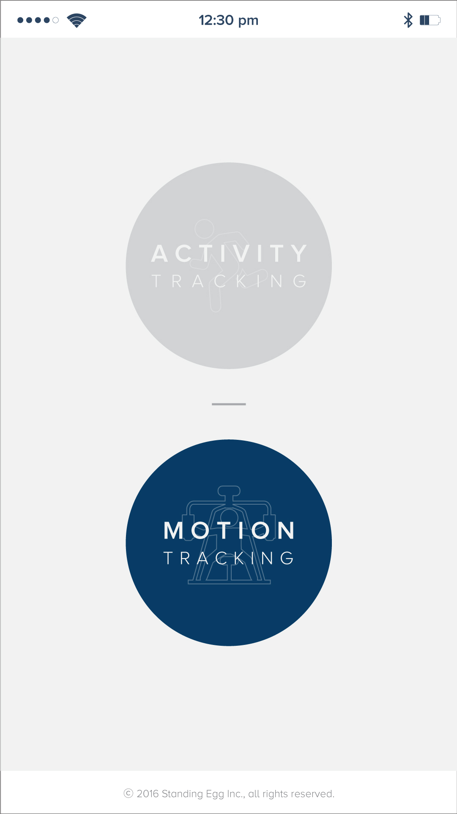
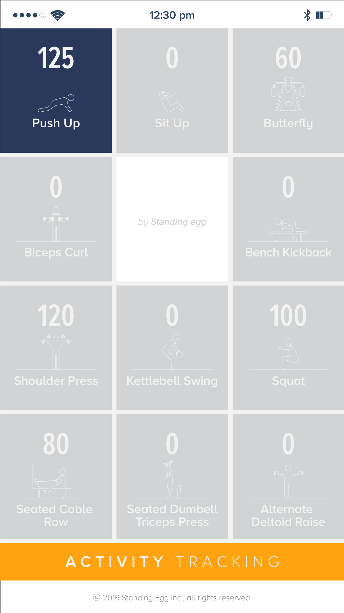
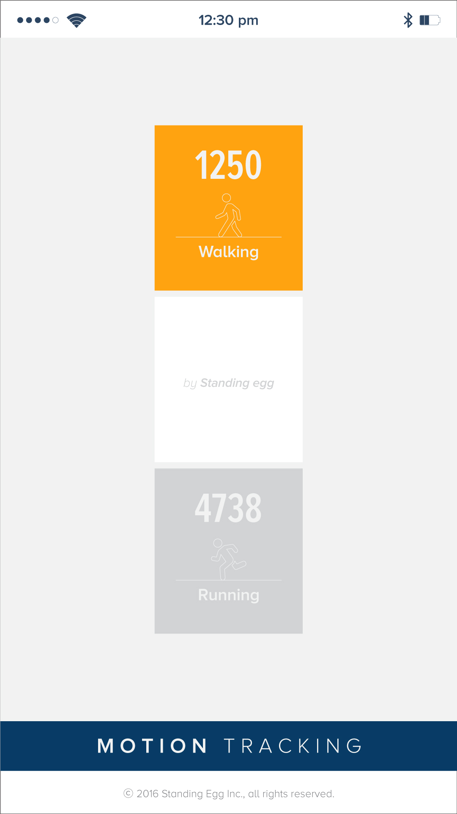

Standing-Egg에서 제작한 SGO100 EVK board의 fitness알고림즘과 walk&running 알고리즘을 적용한 두가지 모드를 packet으로 암호화 변환하여 BLE모듈과 wifi모듈을 통해 앱으로 전송 시키는 프로젝트 
Wifi는 udp 통신을 하며 BLE 4.0 통신을 한다. StnEggPkt.java에서 패킷 데이터를 복호화 한다. 기본적으로 PKST 다음에 오는 packet data가 실 데이터. 

fitness motion은 11종으로 motion의 따라 카운트 수치를 증가시키거나 보여주는 목적을 가진 app 

## Preview

