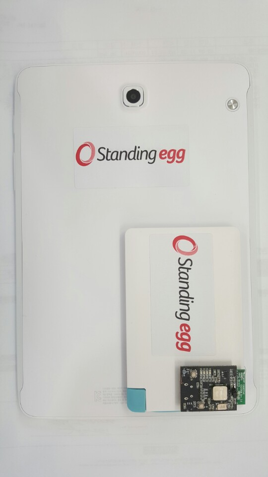
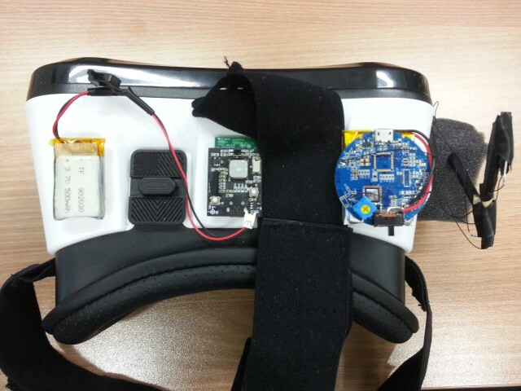
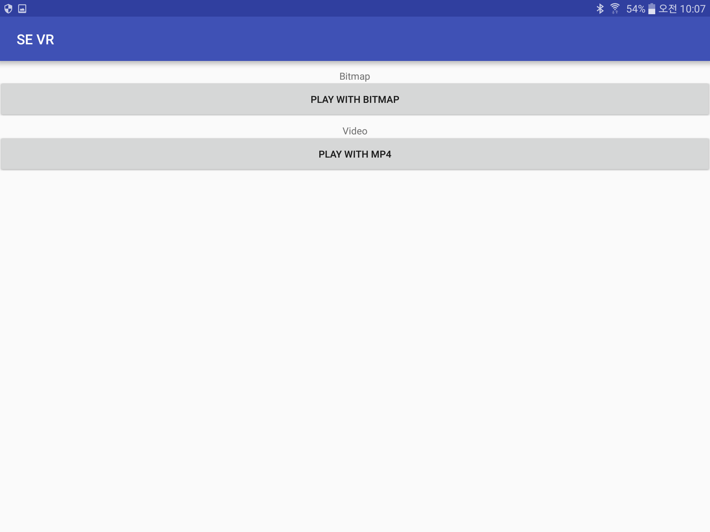

Standing-Egg에서 제작한 SGO100 EVK Black Board와 6축(가속도, 자이로), 9축 센서(가속도, 자이로, 지자계)SensorHub 알고리즘을 암호화 packet으로 변환하여 wifi모듈을 통해 앱으로 전송 시키는 프로젝트 
Wifi는 udp 통신을 한다. StnEggPkt.java에서 패킷 데이터를 복호화 한다. 기본적으로 PKST 다음에 오는 packet data가 실 데이터. 

OpenSource는 MD360Player4Android를 참고 했다. 

## Preview

